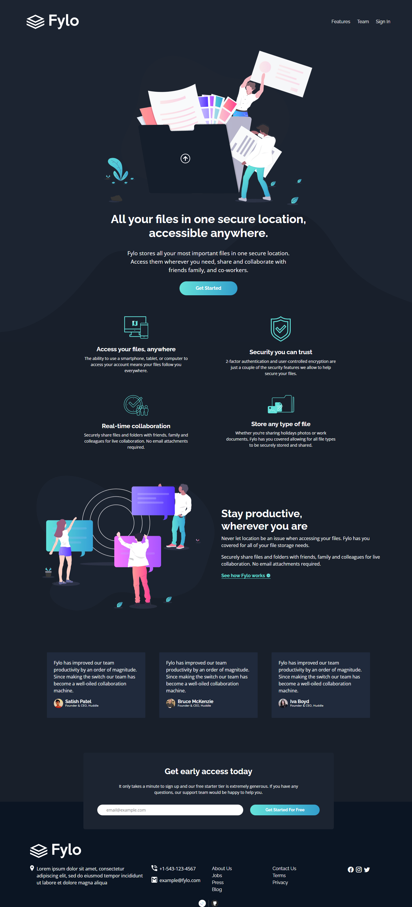
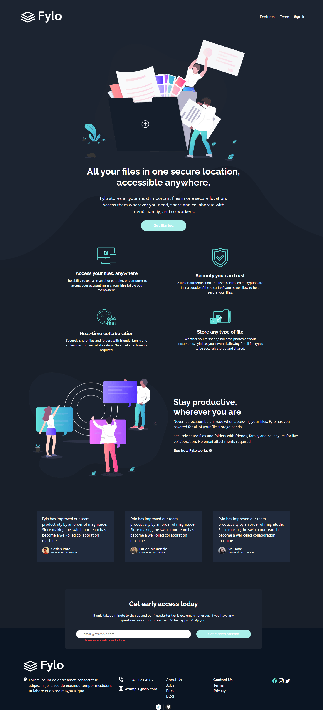
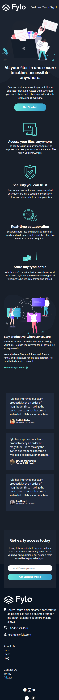

# Frontend Mentor - Fylo dark theme landing page solution

This is a solution to the [Fylo dark theme landing page challenge on Frontend Mentor](https://www.frontendmentor.io/challenges/fylo-dark-theme-landing-page-5ca5f2d21e82137ec91a50fd). Frontend Mentor challenges help you improve your coding skills by building realistic projects. 

## Table of contents

- [Overview](#overview)
  - [The challenge](#the-challenge)
  - [Screenshot](#screenshot)
  - [Links](#links)
- [My process](#my-process)
  - [Built with](#built-with)
  - [What I learned](#what-i-learned)
  - [Continued development](#continued-development)
- [Author](#author)

## Overview

### The challenge

Users should be able to:

- View the optimal layout for the site depending on their device's screen size
- See hover states for all interactive elements on the page

### Screenshot

### Links

- Solution URL: [https://github.com/MoggStephen/fylo-dark-theme-landing-page-master]
- Live Site URL: [https://moggstephen.github.io/fylo-dark-theme-landing-page-master/]

## My process

### Built with

- Semantic HTML5 markup & HTML form handling
- scss nesting, variables and ampersand
- Bootstrap
- Mobile-first workflow
- Fluid responsiveness
- Js to layout the background.

### What I learned

- Learnt how to disable a html form from refreshing the page or sending a request.
- Learnt how to setup an underlay and use js to maintain correct positioning.

### Continued development

- Continue using bootstrap!

## Author

- Frontend Mentor - [@MoggStephen](https://www.frontendmentor.io/profile/MoggStephen)